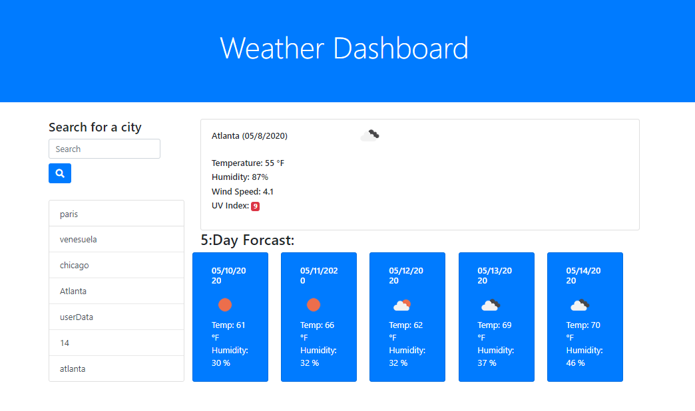

<h1>Weather-Dashboard</h1>

Please visit the deployed project at:

 <h2>Description</h2>

This weather dashboard application has search functionality to find current weather conditions and future weather outlook for multiple cities.

This app uses the OpenWeather API to retrieve weather data for cities. It runs in the browser and features dynamically updated HTML and CSS powered by jQuery.

It displays the following current weather conditions: -City -Date -Icon image (visual representation of weather conditions) -Temperature -Humidity -Wind speed -UV index

It also inncludes a search history so that users can access their past search terms. Clicking on the city name performs a new search that returns current and future conditions for that city.

finally, this app includes a 5-Day Forecast below the current weather conditions.

Each day for the 5-Day Forecast displays the following: -Date -Icon image (visual representation of weather conditions) -Temperature -Humidity

# Demo

